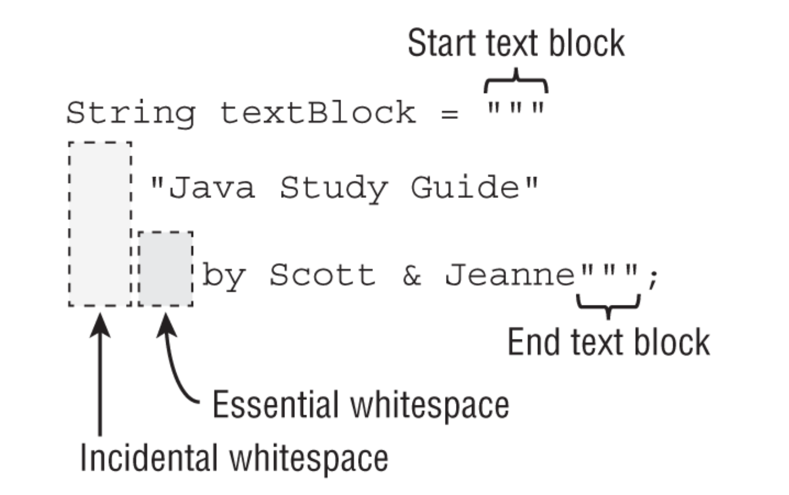

# Building Blocks

## Package declaration and imports
- import statements tell Java which packages to look in for
classes
- wildcard import all direct classes of a packagé ```java
import java.util.*;  
```
- The import statement doesn’t bring in
child packages, fields, or methods; it imports only classes directly under the package
- everything in java.lang is always automatically imported.
- can't import two class with same name
  ```java
  import java.util.*;
  import java.sql.*; // causes Date declaration to not compile

  import java.util.Date;
  import java.sql.Date; // does not compile
  ```
  a solution can be to use the fully qualified class name for one of the type or to remove import and use fully qualified
  type  when declaring the variable instead.
  ```java
  import java.util.Date;
  import java.sql.*;

  //
  public Myclass{
    java.util.Date date;
    java.sql.Date sqlDate;
  }
  ```

  
## Class structure
### Classe and source file
 - A top-level
class is often public, which means any code can call it.
-  Java does
not require that the type be public
  -  ou can even put two types in the same file. When you do so, at most one of the top-level
types in the file is allowed to be public
 - If you do have a public type, it needs to match the filename
### Ordering Elements in a Class
//WIP Add exemaple with P I C static init , const an dorder

## Data types
### Primite vs refrence types
2 data types : 
- **Primitive type** :
    - Java has eight built-in
data types, referred to as the Java primitive types. primitive is just a single value in memory, such as a number
or character.
     - Primitives do not have methods declared on them

| Keyword | Type                 | Min value         | Max value          | Default value | Example   |
|---------|----------------------|-------------------|--------------------|---------------|-----------|
| boolean | true or false        | n/a               | n/a                | false         | true      |
| byte    | 8-bit integral value | -128              | 127                | 0             | 123       |
| short   | 16-bit integral value| -32,768           | 32,767             | 0             | 123       |
| int     | 32-bit integral value| -2,147,483,648    | 2,147,483,647      | 0             | 123       |
| long    | 64-bit integral value| -2^63             | 2^63 – 1           | 0L            | 123L      |
| float   | 32-bit floating-point value | n/a        | n/a                | 0.0f          | 123.45f   |
| double  | 64-bit floating-point value | n/a        | n/a                | 0.0           | 123.456   |
| char    | 16-bit Unicode value | 0                 | 65,535             | \u0000        | 'a'       |

numeric literals can have (mutiple) underscores in numbers to make them easier to read (expept at begining, end, around decimal point):
```java
double notAtStart = _1000.00; // DOES NOT COMPILE
double notAtEnd = 1000.00_; // DOES NOT COMPILE
double notByDecimal = 1000_.00; // DOES NOT COMPILE
double annoyingButLegal = 1_00_0.0_0; // Ugly, but compiles
double reallyUgly = 1__________2; // Also compiles
```

- **Reference type** : A reference type refers to an object (an instance of a class). Unlike primitive types that hold
their values in the memory where the variable is allocated, references do not hold the value
of the object they refer to. Instead, a reference “points” to an object by storing the memory

### Text blocks



Incidental whitespace just happens to be there to make the code easier to read. 
You can reformat your code and change the amount of incidental whitespace without any impact on your String value.


[Text Blocks](../src/main/java/org/enricogiurin/ocp17/book/ch1/textblocks/TextBlocks.java)
```java
String tb = """
    Hello
    World""";
```
the code within the `"""` and `"""` is just text.   
text blocks require a break between beginning and the end.

Imagine a vertical line drawn on the leftmost non-whitespace character in your text block. 
Everything to the left of it is **incidental whitespace**, and everything to the right is **essential whitespace**.
#### Example
```java
String s = """aaa"""; //does not compile
```
**Trailing whitespace**: _spazi bianchi finali_ (IT)

```jshelllanguage
jshell> var text = """
   ...> John is a good guy\
   ...>  and he's my friend""";
text ==> "John is a good guy and he's my friend"
```
Remember that a backslash (**\\**) means to skip the line break.

```java
    String s = """
        Hello \
        World
        """;
    System.out.println(s);  //Hello World
```

#### Escape sequences
There are two special escape sequences for Text Blocks. 
These allow fine-grained control of the processing of line breaks and whitespaces: `\` (followed by a line break) and `\s`.


## Variables

### Local vs Local and Class variables
- **Local variables** do not have a default value and **must be initialized** before use. Furthermore,
the compiler will report an error if you try to read an uninitialized value.
- **Instance** (field) and **Class variables** (static) **do not need** to be initialized before to be used ecause.
 As soon as you declare these variables, they are given a *default value* (compiler give simple vale for the type :  null for an object, zero for the numeric
types, and false for a boolean,...).


### Variable Names

There are only four rules to remember for legal identifiers:
- Identifiers must begin with a letter, a currency symbol, or a _ symbol. Currency symbols
include dollar ($), yuan (¥), euro (€), and so on.
-  Identifiers can include numbers but not start with them.
-  A single underscore _ is not allowed as an identifier.
-  You cannot use the same name as a Java reserved word. 

[Possible names for variables](../src/main/java/org/enricogiurin/ocp17/book/ch1/NameOfVariables.java)

### Variables scope
- **Local variables**: In scope from declaration to the end of the block
- **Method parameters**: In scope for the duration of the method
- **Instance variables**: In scope from declaration until the object is eligible for garbage collection
- **Class variables**: In scope from declaration until the program ends

## Local variable type inference
### use of var
- var can be only used with **local** variables, not as an instance, class or method variable.
- var not a reserved key
- declaration and initialization must be done in **same statement** in order for the compiler to determine the type.
- var cannot be initialized with a null value without a type, it can
be reassigned a null value after it is declared, provided that the underlying
data type is a reference type.

### var initialization
```java
var x;  //does not compile!
x = 5;
```
This compiles as **var** is not a reserved key in java
### var compound declaration
```java
var x=5, y=6; //DOES NOT COMPILE
```
[Usage of var](../src/main/java/org/enricogiurin/ocp17/book/ch1/UsageOfVar.java)
### Garbage Collection
```java
 System.gc();
```
In Java, there are no guarantees about when garbage collection will run. 
The JVM is free to ignore calls to System.gc()

### (apparent) conflict of class names
```java
import org.enricogiurin.ocp17.ch1.fruits.Apple;
import org.enricogiurin.ocp17.ch1.phones.*;

```
In this case will be used class from the package _fruits_ as:  
**importing by class name takes precedence over wildcards!**

## Text Blocks


Incidental whitespace just happens to be there to make the code easier to read. 
You can reformat your code and change the amount of incidental whitespace without any impact on your String value.


[Text Blocks](../src/main/java/org/enricogiurin/ocp17/book/ch1/textblocks/TextBlocks.java)
```java
String tb = """
    Hello
    World""";
```
the code within the `"""` and `"""` is just text.   
text blocks require a break between beginning and the end.

Imagine a vertical line drawn on the leftmost non-whitespace character in your text block. 
Everything to the left of it is **incidental whitespace**, and everything to the right is **essential whitespace**.
### Example
```java
String s = """aaa"""; //does not compile
```
**Trailing whitespace**: _spazi bianchi finali_ (IT)

```jshelllanguage
jshell> var text = """
   ...> John is a good guy\
   ...>  and he's my friend""";
text ==> "John is a good guy and he's my friend"
```
Remember that a backslash (**\\**) means to skip the line break.

```java
    String s = """
        Hello \
        World
        """;
    System.out.println(s);  //Hello World
```

### Escape sequences
There are two special escape sequences for Text Blocks. 
These allow fine-grained control of the processing of line breaks and whitespaces: `\` (followed by a line break) and `\s`.
