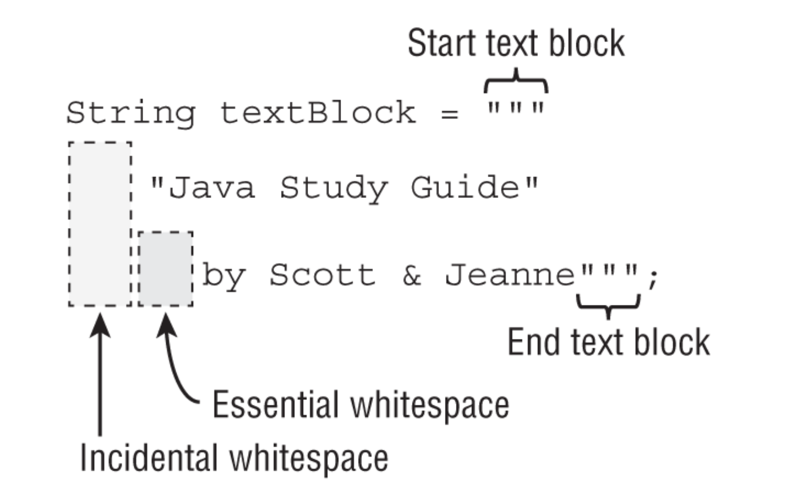

# Building Blocks
## Main

```java
public static void main(String[] args);
```
Memo : PUer Sent (Foutrement) Mauvais.  
While most modifiers, such as public (private not allowed) and static, are required for main() methods,
there are some optional modifiers allowed.
```java
public final static void main(final String[] args) {}
```
In this example, both final modifiers are optional, and the main() method is a valid
entry point with or without them.

## Package declaration and imports
- import statements tell Java which packages to look in for
classes
- wildcard import all direct classes of a package          
  ```java
  import java.util.*;  
  ```
- The import statement doesn’t bring in
child packages, fields, or methods; it imports only classes directly under the package
- everything in java.lang.* is always automatically imported.
- can't import two class with same name (the compiler need to know which class to use)
  ```java
  import java.util.*;
  import java.sql.*; // causes Date declaration to not compile
  
  import java.util.*;
  import java.sql.Date; // is ok as for Date object it will use the one from java.sql
  
  

  import java.util.Date;
  import java.sql.Date; // does not compile, compiler doesnt know which one too  choose
  ```
  a solution can be to use the fully qualified class name for one of the type or to remove import and use fully qualified
  type  when declaring the variable instead.
  ```java
  import java.util.Date;
  import java.sql.*;

  //
  public Myclass{
    java.util.Date date;
    java.sql.Date sqlDate;
  }
  ```
- a class of a package is generally visible for a class of another package, no need to import it.

  
## Class structure
### Classe and source file
 - A top-level class is often public, which means any code can call it.
-  Java does not require that the type be public
-  you can even put two types in the same file. When you do so, at most one of the top-level types in the file is allowed to be public
 - If you do have a public type, it needs to match the filename
### Ordering Elements in a Class
Think of the acronym PIC (picture):   Package, Import, and Class.
```java
package structure; // package must be first non-comment
import java.util.*; // import must come after package
public class Meerkat { // then comes the class
  double weight; // fields and methods can go in either order
  public double getWeight() {
    return weight;
  }
  double height; // another field -they don't need to be together
}
```

### Class initialisation order
 
```java
public class Tests {
    // Instance initialization block: runs every time an object is created, before the constructor.
    {
        System.out.println("3. Init");
    }

    // Static initialization block: runs once when the class is first loaded.
    static {
        System.out.println("1. static init");
    }

    // Constructor: runs after the instance initialization block when an object is created.
    public Tests() {
        System.out.println("4. constructor");
    }

    public static void main(String[] args) {
        System.out.println("2. main");
        var s = new Tests(); // Creates a new instance of Tests, triggering instance initialization block and constructor.
    }

    // Output order explanation:
    // 1. Static block ("1. static init") runs when the class is first loaded.
    // 2. main method ("2. main") runs after the class is loaded.
    // 3. Instance initialization block ("3. Init") runs before the constructor when a new object is created.
    // 4. Constructor ("4. constructor") runs after the instance initialization block.
}
```

## Data types
### Primite vs Reference types
2 data types : 
- **Primitive type** :
    - Java has eight built-in
data types, referred to as the Java primitive types. primitive is just a single value in memory, such as a number
or character.
     - Primitives do not have methods declared on them

| Keyword | Type                 | Min value         | Max value          | Default value | Example                                                                                            |
|---------|----------------------|-------------------|--------------------|---------------|----------------------------------------------------------------------------------------------------|
| boolean | true or false        | n/a               | n/a                | false         | true                                                                                               |
| byte    | 8-bit integral value | -128              | 127                | 0             | 123                                                                                                |
| short   | 16-bit integral value| -32,768           | 32,767             | 0             | 123                                                                                                |
| int     | 32-bit integral value| -2,147,483,648    | 2,147,483,647      | 0             | 123                                                                                                |
| long    | 64-bit integral value| -2^63             | 2^63 – 1           | 0L            | 123L                                                                                               |
| float   | 32-bit floating-point value | n/a        | n/a                | 0.0f          | 123.45f<br>123 is valid too (int promoted to float).<br/>123.45 is not (double is large than floa) |
| double  | 64-bit floating-point value | n/a        | n/a                | 0.0           | 123.456                                                                                            |
| char    | 16-bit Unicode value | 0                 | 65,535             | \u0000        | 'a'                                                                                                |

Numeric literals can have (mutiple) underscores in numbers to make them easier to read (expept at begining, end, around decimal point):
```java
double notAtStart = _1000.00; // DOES NOT COMPILE
double notAtEnd = 1000.00_; // DOES NOT COMPILE
double notByDecimal = 1000_.00; // DOES NOT COMPILE
double annoyingButLegal = 1_00_0.0_0; // Ugly, but compiles
double reallyUgly = 1__________2; // Also compiles
```


- **Reference type** : A reference type refers to an object (an instance of a class). Unlike primitive types that hold
their values in the memory where the variable is allocated, references do not hold the value
of the object they refer to. Instead, a reference “points” to an object by storing the memory

with parse rturn aprimitive an valueOf not in java phylosphy ?


#### Creating Wrapper Classes
Each primitive type has a wrapper class, which is an object type that corresponds to the
primitive. T

```java
int primitive = Integer.parseInt("123");//parseX returns primitive type
Integer wrapper = Integer.valueOf("123");//valueOf returns wrapper reference type
```

#### To string and type conversion
Lossy conversion from double  (like from (64bits) to float (32buts))
is not allowed without explicit casting, because it can result in the loss of precision.
Java is strict about type conversions to prevent unintended data loss.

```java
// Declaring a float value requires the 'f' suffix to indicate it's a float, not a double.
float myFloat = 1.23f;
float myFloat = 1.23;//DOES NOT COMPILE incompatible types: possible lossy conversion from double to float

//the f suffix is not displayed when printing a float value because 
// the f is considered a syntactical hint for the compiler, not part of the actual value
System.out.println(myFloat);  // Output: 1.23 (no 'f' suffix in printed value)
```
### Text blocks



Incidental whitespace just happens to be there to make the code easier to read. 
You can reformat your code and change the amount of incidental whitespace without any impact on your String value.


```java
String tb = """
    Hello
    World""";
```
The code within the `"""` and `"""` is **just text**.  
```java
String block = """
        doe "+maVar""";  //print "doe "+maVar"
```
Text blocks require a break between beginning and the end.
```java
String block = """doe"""; // DOES NOT COMPILE
```


Imagine a vertical line drawn on the leftmost non-whitespace character in your text block. 
Everything to the left of it is **incidental whitespace**, and everything to the right is **essential whitespace**.
#### Example
```java
String s = """aaa"""; //does not compile
```
**Trailing whitespace**: _spazi bianchi finali_ (IT)

```jshelllanguage
jshell> var text = """
   ...> John is a good guy\
   ...>  and he's my friend""";
text ==> "John is a good guy and he's my friend"
```
Remember that a backslash (**\\**) means to skip the line break.

```java
    String s = """
        Hello \
        World
        """;
    System.out.println(s);  //Hello World
```

#### Escape sequences
There are two special escape sequences for Text Blocks. 
These allow fine-grained control of the processing of line breaks and whitespaces: `\` (followed by a line break, Omits new line on
that line) and `\s (Two spaces)`.


## Variables

### Local and Class variables
- **Local variables** do not have a default value and **must be initialized** before use. Furthermore,
the compiler will report an error if you try to read an uninitialized value.
- **Instance** (field) and **Class variables** (static) **do not need** to be initialized before to be used because.
 As soon as you declare these variables, they are given a *default value* (compiler give simple vale for the type :  null for an object, zero for the numeric
types, and false for a boolean,...).


### Variable Names

There are only four rules to remember for legal identifiers:
- Identifiers must begin with a letter, a currency symbol, or a _ symbol. Currency symbols
include dollar ($), yuan (¥), euro (€), and so on.
-  Identifiers can include numbers but not start with them.
-  A single underscore _ is not allowed as an identifier.
-  You cannot use the same name as a Java reserved word. 


### Variables scope
- **Local variables**: In scope from declaration to the end of the block
- **Method parameters**: In scope for the duration of the method
- **Instance variables**: In scope from declaration until the object is eligible for garbage collection
- **Class variables**: In scope from declaration until the program ends

## Local Variable Type Inference (LVTI)
### Use of LVTI : var
- var can be only used with **local** variables, not as an instance, class or method variable.
- declaration and initialization must be done in **same statement** in order for the compiler to determine the type.
- var cannot be initialized with a null value without a type, it can
be reassigned a null value after it is declared, provided that the underlying
data type is a reference type.
- var not a reserved key

### var initialization
```java
var pileOfPapersToFile = new PileOfPapersToFileInFilingCabinet();//OK

var question; // DOES NOT COMPILE - the, compiler looks only at the line with the declaration
question = 1;

public void twoTypes() {
    int a, var b = 3; // DOES NOT COMPILE -All the types declared on a single line must be the same type and share the same declaration
    var n = null; // DOES NOT COMPILE - This could be any reference type
}


public void Var() {
  Var var = new Var();//OK var is NOT a reserved keyword
}

public class VarKeyword {
  var tricky = "Hello"; // DOES NOT COMPILE, only LOCAL variable, not INSTANCE
}
```

### Garbage Collection
```java
System.gc();
```
In Java, there are no guarantees about when garbage collection will run. 
The JVM is free to ignore calls to System.gc()
