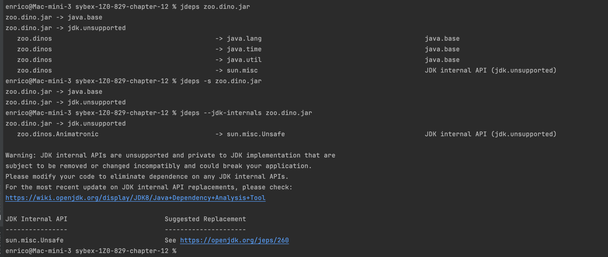

# Modules - commands

## Compiling Module
Extended Form
```shell
javac --module-path mods -d feeding feeding/zoo/animal/feeding/*.java feeding/module-info.java
```
The `-d `option is used to specify the destination directory for the compiled Java class files.

Abbreviated Form
```shell
javac -p mods -d feeding feeding/zoo/animal/feeding/*.java feeding/module-info.java
```
### add-exports
If you must use an internal API that has been made inaccessible by default, then you can break encapsulation using the `--add-exports` command-line option.
```shell
$javac -p out --add-exports moduleA/com.example.util=moduleB -d out/moduleB **/.java
```
## Running module - java
Extended Form
```shell
java --module-path mods --module zoo.animal.feeding/zoo.animal.feeding.Task
```
Abbreviated Form
```shell
java -p mods -m zoo.animal.feeding/zoo.animal.feeding.Task
```
### describe modules
```shell
$ java -p mods -d moduleName
$ java --module-path mods --describe-module moduleName
```


```shell
requires java.base mandated
requires zoo.animal.care
requires zoo.animal.feeding
requires zoo.animal.talks
contains zoo.staff
```
### list
```shell
$ java --list-modules
```

### show-module-resolution
```shell
java -p mods -m zoo.animal.feeding/zoo.animal.feeding.Task --show-module-resolution
```
When this option is present, the JVM will output information about how it resolved module dependencies.

## Running module - jar
```shell
$ jar -cvf mods/zoo.animal.feeding.jar -C feeding/ .
```

### describe-module
```shell
$ jar --file mods/zoo.staff.jar --describe-module
#equivalent
$ jar --file mods/zoo.staff.jar -d
 ```


## jdeps
The jdeps command lists information about dependencies within a module.
```shell
$ jdeps –s zoo.animal.puppy.jar 
```
* `-s` / `-summary` - Summarizes output
* `--jdk-internals` / `-jdkinternals` - The jdeps -jdkinternals option includes analysis of dependencies on JDK internal APIs
### Screenshot jdeps commands



## jlink
extended
```shell
$ jlink --module-path mods --add-modules zoo.animal.talks --output zooApp 
```
Abbreviated
```shell
$ jlink -p mods --add-modules zoo.animal.talks --output zooApp 
```
There is no abbreviated form for the parameter **output**.
* `--add-modules` - List of modules to package
* `--output` - Name of output directory  

This is the contents of the generated folder:
```shell
$ cd zooAPP/    
$ ls
bin conf include legal lib man release
```
## jmod
```shell
#generated by CGPT
$ jmod create --class-path out/moduleA --module-version 1.0 --module-path out out/moduleA.jmod
```
- create
- extract
- describe
- list