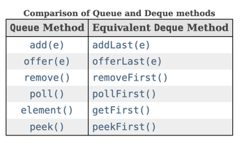
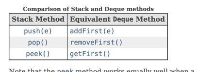

# Collections and Generics
## Generics

````java
public class Money<T> {
    private T currency;
    public T createT() {
        //Type parameter 'T' cannot be instantiated directly
        // return new T();
    }
}

````
## Bounding Generic Types
### Upper-Bounded wildcards

```java
List<? extends Number> listOfInteger = new ArrayList<>();
//does not compile...what if it's a list of AtomicInteger
//listOfInteger.add(new Integer(3));  

//does not compile...what if it's a list of Integer
//listOfInteger.add(new AtomicInteger(2)); 
```
We cannot add element to a list declared s upper bounded wildcards!


### Lower-Bounded wildcards

```java
List<? super IOException> exceptions = new ArrayList<Exception>();
//
exceptions.add(new IOException("error"));// yes we can add it
exceptions.add(new FileNotFoundException("error"));// yes we can add it

//we cannot add Exception as it could be a list of IOException and Exception is not an IOException
//exceptions.add(new Exception("error"));
```
We can only add element whose type is **IOException** or one of its children.
## Collections
### TreeSet
````java
Comparator<Integer> comparator = (n1,n2)->n1-n2;
TreeSet<Integer> set1 = new TreeSet<>(comparator);
TreeSet<Integer> set2 = new TreeSet<>(Set.of(1, 2, 3));
````

### Comparator
package: java.util
```java
int compare(T o1, T o2);
```

### Comparable
package: java.lang
```java
int compareTo(T o1);
```

### Deque





 - LinkedList implements Deque
 - ArrayDeque implements Deque